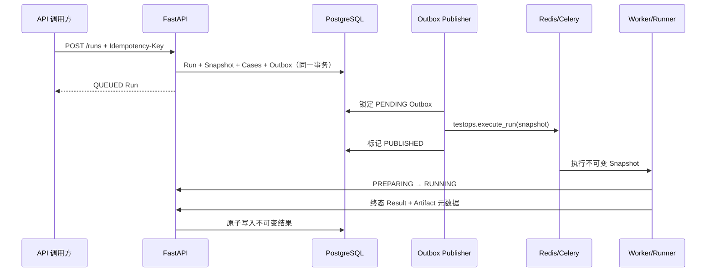

# M2：控制面持久化与 Run 调度

## 完成范围

- SQLAlchemy 2 异步模型覆盖 Project、Target、Environment、Case Baseline、
  Automation Package、Run、Run Case、Artifact、Dispatch Outbox 和 Audit Log；
- Alembic `20260812_0001` 可生成 PostgreSQL 事务 DDL；
- FastAPI 提供项目资源管理、不可变基线发布、幂等 Run 创建、Run 查询和取消 API；
- 创建 Run 时在单个数据库事务中冻结 Run Snapshot、Run Case 和 `run.queued` Outbox；
- 相同项目和 `Idempotency-Key` 的相同请求安全重放，不同请求返回冲突；
- Runner 使用专用 Token 回报 PREPARING/RUNNING 状态及终态 Run Result；
- Result 与 Artifact 元数据一次写入，完全相同的结果可重放，后续不同结果不可覆盖；
- Celery Worker 执行 WebPlaywrightAdapter，并在重试时优先重放已落盘结果；
- Outbox 发布器支持批量锁定、失败退避、确定性任务 ID 和持续轮询；
- 排队中取消直接进入 CANCELED；执行中取消在用例边界生效。

## 一致性边界



Outbox 解决“Run 已提交但队列消息丢失”的双写问题。消费者仍以 Run 状态和不可变
Result 为幂等边界；相同结果可以恢复重放，冲突结果会被控制面拒绝。

## 安全约束

- Runner 内部回调默认关闭，只有配置 `RUNNER_CALLBACK_TOKEN` 后才启用；
- Snapshot 只保存 `secret://` 引用，Worker 从进程环境解析实际值；
- 环境普通变量拒绝 token、password、secret 等疑似密钥名称；
- 审计日志记录资源变更、状态迁移、结果摘要和制品数量，不记录密钥值。

## 验证命令

```powershell
python -m pytest
python -m ruff check .
python -m ruff format --check .
python -m alembic upgrade head --sql
python scripts/export_schemas.py --check
python scripts/verify_artifacts.py
```

API 集成测试使用临时 SQLite 验证事务和接口语义；Alembic 离线输出验证 PostgreSQL
方言 DDL。真实 PostgreSQL、Redis 和 Celery 多进程冒烟将在容器化联调环境继续覆盖。

## 下一步

M3 实现登录/RBAC/项目成员关系、用例草稿与发布工作流，以及 Vue 3 + TypeScript +
Element Plus 管理端的项目、基线和 Run 列表首个纵向闭环。
