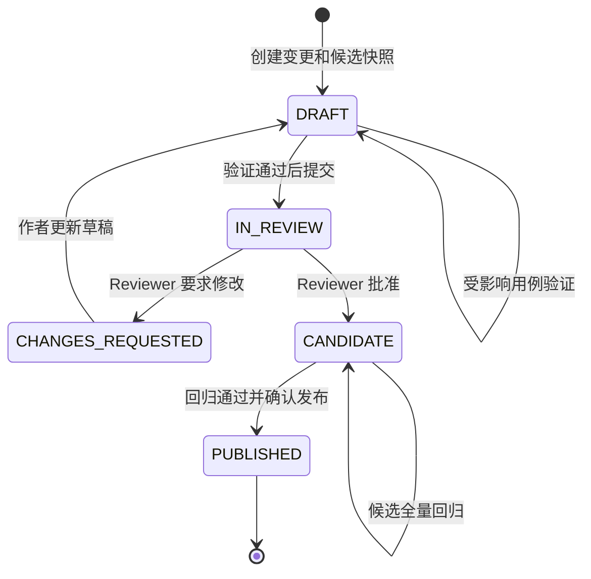

# M3：身份、用例治理与 Vue 管理端

## 完成范围

- 本地身份提供者支持一次性系统管理员初始化、用户创建、登录、注销和当前会话查询；
- 密码使用随机盐 scrypt 哈希，不透明会话 Token 只以 SHA-256 摘要入库并支持过期和吊销；
- System Admin 可管理全局资源，Project Admin、Tester、Reviewer、Viewer 通过项目成员关系授权；
- 原有 Project、Target、Environment、Baseline、Automation Package 和 Run API 全部接入会话认证与项目权限；
- 用例变更支持 ADD、MODIFY、DELETE，创建时生成确定性候选基线和字段级 Diff；
- Tester 可运行受影响用例验证、提交审批；Reviewer 审批且提交人不能自审；
- 审批通过后进入 Candidate，只有对应候选基线的全量回归通过才能确认发布；
- Vue 3 管理端覆盖登录、所属项目、Released 基线、Run、变更详情和跨项目审批工作台；
- Alembic `20260812_0002` 增加身份、会话、成员关系、变更、审批和一次性初始化标记。

## 权限边界

| 角色 | 核心权限 |
| --- | --- |
| System Admin | 全局用户、项目与所有项目资源 |
| Project Admin | 项目内全部管理与审批能力 |
| Tester | 读取项目、创建/编辑/提交变更、创建/取消 Run |
| Reviewer | 读取项目与变更、审批他人提交的变更 |
| Viewer | 只读项目、Released 基线和 Run |

项目创建者会自动成为 Project Admin。非系统管理员只能看到自己拥有成员关系的项目；
项目级 API 不再接受可伪造的 Actor Header。

## 用例发布状态机



每次编辑都会废弃旧的内部候选快照并生成新摘要；对外基线列表只返回 Released。
发布动作校验回归 Run 的基线、终态、结果摘要和启用用例数量，避免拿其他版本的结果发布。

## 关键 API

- `POST /api/v1/auth/bootstrap`：使用 `X-Bootstrap-Token` 一次性创建首位 System Admin；
- `POST /api/v1/auth/login`、`POST /api/v1/auth/logout`、`GET /api/v1/auth/me`；
- `POST /api/v1/users`、`PUT /api/v1/projects/{project_id}/members`；
- `POST/GET /api/v1/projects/{project_id}/change-requests`；
- `POST .../validation-runs`、`POST .../submit`、`POST .../decision`；
- `POST .../regression-runs`、`POST .../publish`；
- `GET /api/v1/internal/runs/{run_id}`：仅供配置了 Runner Token 的 Worker 获取快照。

## 安全与一致性约束

- 初始化接口未配置 Token 时返回 `503`，已完成后返回 `409`；唯一系统标记关闭并发双初始化窗口；
- 登录失败统一返回相同错误，并使用固定假哈希缩小用户名是否存在造成的时序差异；
- Bearer Scheme 大小写不敏感，会话过期、吊销或用户禁用后立即拒绝；
- 所有成员变更、草稿、验证、提交、审批、发布和身份操作写入 Audit Log；
- 变更提交人与审批人强制分离；Released 基线没有更新接口；
- 浏览器只持有不透明会话 Token，数据库不保存明文密码、会话 Token 或初始化 Token。

## 管理端

管理端使用 Vue 3、TypeScript、Vue Router、Element Plus 和 Vite。开发服务器代理 `/api`、
`/healthz`、`/readyz` 到 FastAPI；也可通过 `VITE_API_URL` 指定控制面地址。

实际浏览器冒烟覆盖登录、项目/基线加载、创建 MODIFY 草稿、字段 Diff、资源选择和验证任务创建。
该检查发现并修复固定侧边栏造成的内容宽度溢出，以及宽 Diff 表挤压操作卡片的问题。

## 验证命令

```powershell
python -m pytest
python -m ruff check .
python -m ruff format --check .
python -m alembic upgrade head --sql
python scripts/export_schemas.py --check
python scripts/verify_artifacts.py

Set-Location apps/frontend
npm.cmd run typecheck
npm.cmd run build
npm.cmd audit
```

集成测试使用临时 SQLite 验证完整身份/RBAC和变更发布流程；Alembic 离线 SQL 验证
PostgreSQL 方言迁移。本阶段没有读取或修改同级旧 `web` 项目的密钥、环境和运行产物。

## 下一步

M4 优先实现对象存储制品上传/访问控制、Run 事件实时更新和执行详情页，再补齐管理端的
用户/成员管理、项目创建与更细粒度的运行诊断体验。
