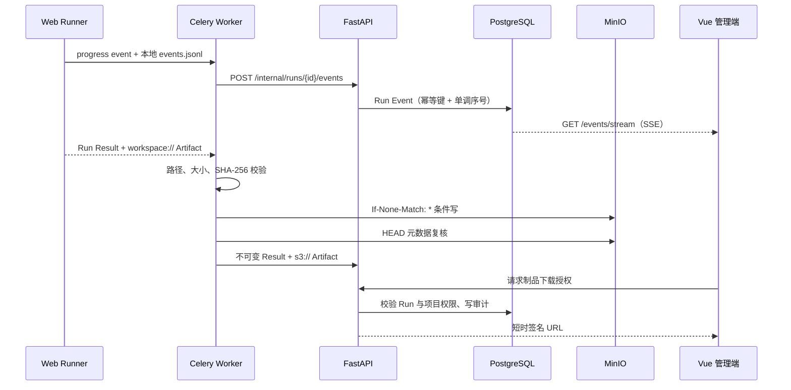

# M4：执行可观测性与制品管理

## 完成范围

- `run_events` 持久化系统与 Runner 事件，按 Run 内严格递增序号输出；
- Runner 在执行过程中实时上报事件，完成前从本地 `events.jsonl` 幂等补传；
- 控制面提供历史事件列表和带会话认证的 Server-Sent Events（SSE）接口；
- Worker 上传制品前校验本地文件路径、大小和 SHA-256，上传后再次检查对象元数据；
- MinIO 对象键固定为 `runs/{run_id}/{artifact_id}/{safe_name}`，条件写禁止覆盖已有对象；
- 制品下载先校验 `run:read` 项目权限，再签发短时 S3 URL 并记录审计事件；
- Run 详情响应包含按快照顺序的 Run Case 和制品元数据；
- Vue 管理端增加 Run 详情、实时事件时间线、逐用例状态、失败诊断和制品下载。

Alembic `20260812_0003` 增加 `run_events` 表、Run 内序号/幂等键唯一约束和查询索引。

## 数据与传输闭环



实时回调失败不会改变测试用例结果。Runner 仍先把事件写入独立 Run 工作区；Worker
在提交不可变结果之前顺序重放整个 JSONL，Celery 重试也会再次重放。控制面使用事件
内容摘要做幂等键，因此重复传输不会产生重复时间线条目。

## API

- `POST /api/v1/internal/runs/{run_id}/events`：Runner Token 认证的单事件回调；
- `GET /api/v1/runs/{run_id}/events`：项目授权后的历史事件分页读取；
- `GET /api/v1/runs/{run_id}/events/stream`：支持 `after_sequence` 和 `Last-Event-ID`；
- `GET /api/v1/runs/{run_id}`：包含 Snapshot、Result、Run Case 和 Artifact；
- `GET /api/v1/runs/{run_id}/artifacts/{artifact_id}/access`：短时下载授权。

SSE 使用普通 `fetch` 流而非原生 `EventSource`，原因是会话 Token 必须保留在
`Authorization` Header，不能放入 URL。前端按事件序号去重，网络中断后从最后序号重连。

## 制品安全边界

1. `workspace://` URI 必须属于当前 Run，规范化后的文件必须仍在 Run 工作区内；
2. 文件内容必须与 Runner Result 声明的大小和 SHA-256 完全一致；
3. 对象键由 Run ID、Artifact ID 和清洗后的文件名组成，不接受 Runner 提供的对象键；
4. 写入携带 `If-None-Match: *`，若对象已存在则只允许摘要和大小完全一致的幂等重放；
5. 控制面只为当前 Run、配置 Bucket 下的受管 `s3://` URI 签名；
6. 下载 URL 默认 300 秒有效，浏览器不接触 MinIO Access Key/Secret Key；
7. 每次下载授权写入 `artifact.access_granted` 审计，不记录签名 URL。

本地 `compose.yaml` 继续使用 MinIO Root 凭据方便开发。生产部署必须创建仅限目标 Bucket
读写的 Worker 凭据和只需签名读取的 API 凭据，并通过部署平台密钥系统注入。

## 前端诊断体验

从项目“运行记录”点击 Run ID 进入详情页，可查看：

- 当前状态、完成用例数、异常数和累计用例耗时；
- 基线、自动化包、浏览器、配置摘要和 Snapshot 摘要；
- 断言、步骤或基础设施错误及逐用例执行状态；
- 系统/Runner 事件的统一时间线和实时连接状态；
- Screenshot、Trace、Video、Log 等制品及其大小和摘要。

## 配置

```text
MINIO_ENDPOINT=http://127.0.0.1:9000
MINIO_PUBLIC_ENDPOINT=http://127.0.0.1:9000
MINIO_ACCESS_KEY=testops-local
MINIO_SECRET_KEY=change-me-local-only
MINIO_BUCKET=testops-artifacts
MINIO_REGION=us-east-1
ARTIFACT_URL_TTL_SECONDS=300
RUN_EVENT_POLL_SECONDS=0.5
RUN_EVENT_HEARTBEAT_SECONDS=15
```

下载 URL 有效期限制为 30–3600 秒；事件数据库轮询间隔限制为 0.1–10 秒，心跳间隔
限制为 5–60 秒。生产反向代理必须关闭 SSE 响应缓冲。

Worker 使用 `MINIO_ENDPOINT` 上传；API 优先使用 `MINIO_PUBLIC_ENDPOINT` 生成浏览器可访问的
签名 URL，未配置时回退到 `MINIO_ENDPOINT`。

## 验证

```powershell
python -m pytest
python -m ruff check .
python -m ruff format --check .
python -m alembic upgrade head --sql
python scripts/export_schemas.py --check
python scripts/verify_artifacts.py

Set-Location apps/frontend
npm.cmd run typecheck
npm.cmd run build
npm.cmd audit
```

测试覆盖事件回调鉴权、幂等重放、未知用例拒绝、严格序号、SSE 恢复点、Run 详情、
下载授权审计、对象 URI 边界、路径穿越、摘要/大小校验、条件写幂等和 Worker JSONL 补传。

## 后续方向

- 用 Redis Pub/Sub 或 PostgreSQL LISTEN/NOTIFY 替代当前短轮询，以支持更高并发 SSE；
- 在真实 PostgreSQL、Redis、Celery、MinIO 多进程环境增加持续集成冒烟；
- 增加管理端项目创建、用户/成员管理、运行趋势和失败聚类报表；
- 生产 Bucket 启用版本控制、生命周期清理和独立只读/写入服务账号。
