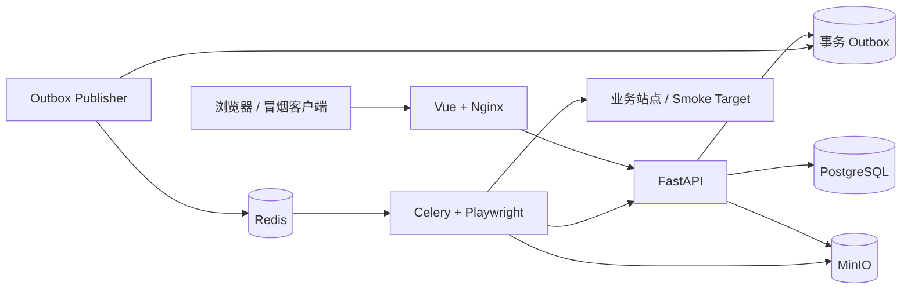

# M5.1：完整容器运行基座

## 目标与当前状态

M5.1 将 M4 以前需要多个 PowerShell 窗口手工启动的组件收敛为一个可重复的 Compose
运行单元，并提供不依赖外部业务系统的端到端验收入口。

代码、配置、静态契约测试和本机单元回归已经实现。当前开发机没有 Docker、Podman
或兼容容器运行时，因此镜像构建、`docker compose config` 和真实多进程冒烟尚未执行；
在这三项通过前，M5.1 不能视为完成运行环境验收。

## 服务拓扑



Compose 的启动门控为：

1. PostgreSQL、Redis、MinIO 先通过健康检查；
2. `migrate` 只在 PostgreSQL 就绪后执行 Alembic `upgrade head`；
3. `minio-init` 幂等创建并启用版本控制的制品 Bucket；
4. API 等待迁移和 Bucket 初始化完成，再以 `/readyz` 对外声明就绪；
5. Outbox Publisher 与 Worker 等待 API、Redis 和 MinIO 就绪；
6. 前端 Nginx 等待 API 就绪，并用同源反向代理承载 API 与 SSE；
7. `smoke-target` 只在显式启用 `smoke` profile 时启动。

PostgreSQL、Redis、MinIO 和 Runner 工作区分别使用命名卷。`docker compose down`
不会删除这些卷；数据清理必须作为单独、显式的破坏性操作处理。

## 镜像边界

- API/迁移/Outbox 共用 Python 3.12 slim 镜像，以非 root `testops` 用户运行；
- Worker 使用与 Python 包严格匹配的 Playwright 1.60 Chromium 镜像，以非 root
  `pwuser` 运行，并设置 1 GiB 共享内存；
- 前端在 Node 22 阶段执行 `npm ci` 和生产构建，只把 `dist` 放入 Nginx 运行镜像；
- Smoke Target 是独立 Nginx 静态站点，只接受固定本地 QA 凭据，不包含业务数据；
- `.dockerignore` 排除 `.env`、虚拟环境、Node 依赖、构建产物、报告和认证状态。

## 全链路冒烟

```powershell
Copy-Item .env.example .env
docker compose --profile smoke up -d --build
python scripts/smoke_compose.py
```

`scripts/smoke_compose.py` 使用平台正式 REST API 完成以下验证：

- 等待前端反向代理和 API 数据库 readiness；
- 通过独立宿主机端口等待 Smoke Target 健康，避免首次启动时的容器竞态；
- 幂等初始化系统管理员及 `platform-smoke` 项目资源；
- 发布包含成功与预期失败两条用例的确定性不可变基线；
- 通过事务 Outbox、Redis、Celery 和真实 Chromium 执行成功 Run；
- 检查 Run 事件序号单调且包含创建、Runner 进度与结果入库事件；
- 执行预期失败 Run，要求生成 Log、Screenshot 和 Trace；
- 对每个制品申请短时 URL，重新下载并比对 SHA-256 与字节数；
- 检查 Run 详情中不包含实际密钥值。

脚本可以重复运行；项目、目标、环境、基线和自动化包会复用，Run 与幂等键每次新建。
若数据库已经由其他管理员完成过一次性初始化，需通过环境变量提供该管理员的用户名和
密码，或使用新的本地数据库卷。

## 故障恢复验收

```powershell
python scripts/smoke_compose.py --exercise-recovery
```

该模式只操作 Compose 中的 `worker` 与 `outbox` 服务：先停止二者，在停机窗口通过
API 创建 Run，再恢复服务。验收通过要求 PENDING Outbox 记录被重新发布、Worker
执行完成、事件和制品仍满足普通冒烟的全部约束。脚本使用 `finally` 恢复服务，避免
API 创建失败时让本地调度链长期停机。

## 配置与安全边界

- Compose 默认凭据只允许本地开发，实际部署必须通过密钥管理系统注入；
- `RUNNER_CALLBACK_TOKEN` 在 API 与 Worker/Outbox 之间一致，但不进入 Snapshot；
- Worker 只接收 `TESTOPS_SECRET_<绑定名>`，冒烟基线只保存 `secret://` 引用；
- `MINIO_PUBLIC_ENDPOINT` 面向浏览器签名，Worker 使用容器网络内的 MinIO 地址上传；
- Nginx 对 API 关闭代理缓冲，并为 SSE 设置一小时读取超时；
- 生产环境仍需拆分 MinIO 读写服务账号、固定镜像摘要并接入外部 TLS/Ingress。

## 验收清单

已可在无容器运行时的开发机执行：

```powershell
python -m pytest
python -m ruff check .
python -m ruff format --check .
python -m alembic upgrade head --sql
python scripts/export_schemas.py --check
python scripts/verify_artifacts.py

Set-Location apps/frontend
npm.cmd run typecheck
npm.cmd run build
npm.cmd audit
```

安装 Docker 后必须补跑：

```powershell
docker compose --profile smoke config
docker compose --profile smoke build
docker compose --profile smoke up -d
python scripts/smoke_compose.py
python scripts/smoke_compose.py --exercise-recovery
docker compose --profile smoke ps
```

## 2026-08-12 本机验证记录

- `python -m pytest`：56 passed，保留 1 条既有 Starlette TestClient/httpx2 弃用警告；
- `python -m ruff check .`：通过；
- `python -m ruff format --check .`：90 个 Python 文件均已格式化；
- Alembic 离线升级 SQL：`20260812_0001` 至 `20260812_0003` 全链通过，唯一 head 为
  `20260812_0003`；
- JSON Schema 与已发布 Baseline/Runner Job 制品一致性：通过；
- PyYAML 6.0.3 对 Compose 文件的 10 服务拓扑、Anchor 合并与关键依赖解析：通过；
- 前端 `typecheck` 与 Vite 生产构建：通过；
- `npm audit --registry=https://registry.npmjs.org`：0 vulnerabilities；默认 npmmirror
  因未实现 npm audit API 返回 404，未修改用户或项目 registry 配置；
- 工作区未发现私钥、GitHub Token 或 OpenAI Key 形态内容，验证端口均无遗留监听；
- Docker、Podman 与 Docker Compose 均不可用，因此容器构建和真实冒烟仍待补跑。

## 后续方向

- M5.2：系统管理中心，覆盖项目、用户、成员、环境资源和密钥引用管理；
- M5.3：运行运营能力，覆盖筛选、批量取消、重跑和仅失败用例重跑；
- 为完整 Compose 冒烟增加 CI Runner，并在合并门禁中保存服务日志；
- 固定所有基础镜像摘要，增加 PostgreSQL/MinIO 备份恢复演练和容量告警。
