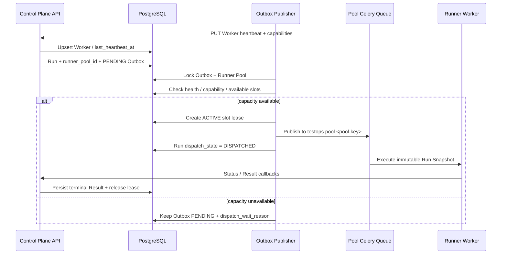

# M7.2：Runner Pool 与执行槽位

## 目标与完成范围

M7.2 在 M7.1 项目配额之外建立真实执行资源边界，使 Run 不再只知道“可以创建”，还能够解释
“由哪个资源池执行、为什么仍在排队、容量恢复后如何继续”。本阶段完成：

- System Admin 创建和维护全局 Runner Pool，配置支持的目标类型、专属 Celery Queue、池级最大并发和
  `ACTIVE`、`DRAINING`、`DISABLED` 生命周期；
- Project Admin 可在测试目标上绑定默认 Pool，也可在环境上覆盖目标绑定；未绑定资源继续使用原有默认
  Celery Queue，保证现有项目平滑迁移；
- Worker 使用内部 Token 和稳定 `worker_key` 上报心跳、Runner 版本、能力标签、浏览器列表和本机槽位；
- Worker 健康状态按服务端 UTC 时间与心跳 TTL 动态计算，过期 Worker 自动停止贡献执行容量；
- Outbox 派发前锁定 Runner Pool，综合池上限、健康 Worker 槽位和 Run 所需能力申请槽位租约；
- Run 终态或排队阶段取消时释放租约，后续等待 Run 可以继续派发；
- 运行运营页和 Run 详情展示资源池等待原因，系统管理中心展示 Pool、Worker、实时容量和心跳状态。

## 调度与一致性边界

同一 Pool 的容量判断使用 `SELECT ... FOR UPDATE` 串行化；可用容量取
`min(pool.max_concurrency, matching healthy worker slots)`。槽位租约与 Outbox 状态在同一数据库事务中更新，
消息仍沿用既有确定性 Celery task id 和 at-least-once 消费边界。

等待容量不是发布失败，不增加 broker 失败次数。当前可观察原因包括：

- `NO_HEALTHY_RUNNER`：Pool 内没有心跳有效且启用的 Worker；
- `RUNNER_CAPABILITY_MISMATCH`：健康 Worker 不支持 Snapshot 的目标类型或浏览器；
- `RUNNER_POOL_CAPACITY_EXHAUSTED`：匹配 Worker 的有效槽位已满；
- `RUNNER_POOL_DRAINING` / `RUNNER_POOL_DISABLED`：资源池不接收新任务；
- `BROKER_PUBLISH_FAILED`：槽位已释放，按原有指数退避重试消息投递。

## 数据库与 API

Alembic `20260813_0006` 新增：

- `runner_pools`：资源池、专属 Queue、目标类型、池级并发和生命周期；
- `runner_workers`：稳定 Worker 身份、能力文档、本机槽位和最后心跳；
- `runner_slot_leases`：Run 对 Pool 槽位的占用与释放历史；
- Target、Environment 和 Run 的 `runner_pool_id`；
- Run 的 `dispatch_state`、`dispatch_wait_reason` 和 `dispatched_at`。

主要 API：

- `GET/POST/PATCH /api/v1/admin/runner-pools`；
- `GET/PATCH /api/v1/admin/runner-workers`；
- `GET /api/v1/runner-pools/catalog`，供项目管理员选择可用 Pool；
- `PUT /api/v1/internal/runner-workers/{worker_key}/heartbeat`；
- 既有 Target、Environment、Run API 返回并维护新增调度字段。

## Worker 与 Compose

- Celery Worker 同时订阅默认 `celery` Queue 和 `testops.pool.<RUNNER_POOL_KEY>`；
- Celery 启动和定期 heartbeat signal 调用控制面心跳 API，失败只记录告警，不中断任务进程；
- Compose 示例 Worker 默认身份为 `compose-web-1`，Pool 为 `default-web`，声明 WEB + Chromium 能力；
- Compose smoke 会幂等创建对应 Pool、绑定 smoke Target，再走正式容量门控执行成功与预期失败 Run。

## 验证记录

- `pytest -q` 共 `69 passed`；Runner Pool 集成测试覆盖无健康 Worker、能力不匹配、成功派发、Pool 专属
  Queue、槽位耗尽、取消释放和自动恢复派发；
- 身份治理测试覆盖 Pool Catalog 可读、管理 API 仅 System Admin 可用、内部心跳必须提供 Runner Token；
- `ruff check .`、Vue 严格 TypeScript 检查和 Vite 生产构建通过，覆盖系统 Runner 管理、项目 Pool 绑定和
  Run 等待原因；
- Alembic 保持单一 Head，并成功生成从 Base 到 `20260813_0006` 的 PostgreSQL 离线 SQL；JSON Schema、
  已发布基线与 Runner Job 的不可变摘要复验通过；
- 本地浏览器闭环确认 ONLINE Worker 和 `1/1` 槽位占用、目标绑定与环境继承、容量耗尽等待原因，以及
  取消占槽 Run 后自动恢复派发并清除等待告警；浏览器控制台无应用错误；
- 平台、API、Worker、前端、Compose 和 smoke 基线版本统一为 `0.10.0`。

真实 PostgreSQL 的高并发槽位争用、Redis/Celery Pool Queue 和多 Worker 心跳仍需在具备 Docker 的环境完成
首次运行验收。Worker 异常退出后的长期僵尸 Run/租约回收将与执行超时和自动回收策略一并实现。

## 下一步

M7.3 建立定时回归与队列运维：Cron 计划、时区和错过触发策略，调度等待时长与积压告警，Run 超时、
失联 Worker 对应租约回收，以及项目级质量趋势和 SLO 基础指标。
