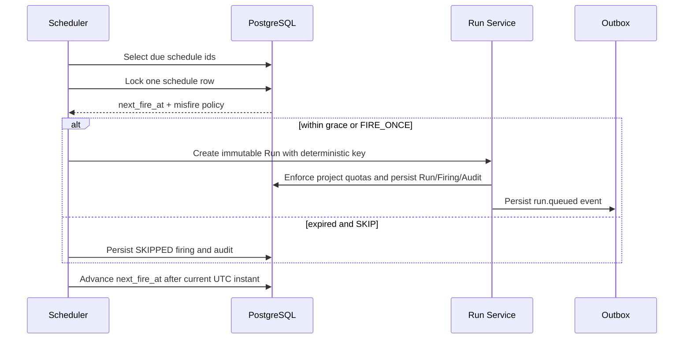

# M7.3：定时回归计划

## 目标与完成范围

M7.3 在既有不可变 Run Snapshot、项目执行配额和 Runner Pool 容量边界上增加项目级定时回归，
使常规回归可以按业务时区自动创建 Run，同时保留可审计的触发原因和错过执行记录。本阶段完成：

- Project Admin 创建、编辑、暂停、归档和手动触发回归计划，Viewer 可读取计划与触发历史；
- 计划固定引用项目内的 Target、Environment、Released Baseline、Automation Package 和用例集合；
- 支持标准五字段数字 Cron、列表、范围和步长，以及 IANA 时区；
- 调度器统一以 UTC 保存和比较触发时间，界面明确显示下一次执行的 UTC 时间；
- 支持 `FIRE_ONCE` 和 `SKIP` 两种 misfire 策略，并配置 60～86400 秒宽限期；
- 每次自动或手动触发均建立计划、触发记录与 Run 的血缘，进入既有配额、Runner Pool、Outbox 和审计链路；
- Compose 增加独立 Scheduler 进程，支持轮询间隔和批次大小配置。

## 时间与幂等语义

Cron 按计划配置的 IANA 时区解释，数据库中的 `next_fire_at`、`scheduled_for` 和
`triggered_at` 均为带时区时间，并在服务边界归一到 UTC。夏令时开始时不存在的本地时间不会触发；
夏令时结束时重复的本地时间按两个不同 UTC 时刻分别计算。日字段和星期字段同时受限时采用标准 Cron
的 OR 语义，星期 `0` 和 `7` 都表示星期日。



自动触发的幂等键由 `schedule_id + scheduled_for` 确定，同一计划时刻最多对应一个触发记录和一个 Run。
手动触发的客户端幂等键先按计划作用域哈希，避免不同计划复用同一 Header 时串用 Run。调度器持有计划行锁，
数据库唯一约束作为并发兜底；`FIRE_ONCE` 在停机恢复后只补建一次 Run，并把下一次时间直接推进到当前时刻之后。

## 数据库与 API

Alembic `20260813_0007` 新增：

- `regression_schedules`：资源引用、Cron、时区、misfire 策略、生命周期和最近触发状态；
- `regression_schedule_firings`：计划时刻、实际触发时刻、触发类型、结果、Run 血缘和错误原因；
- `test_runs.regression_schedule_id` 与 `test_runs.scheduled_for`；
- 项目内计划 Key、计划时刻触发记录的唯一约束，以及到期计划查询索引。

主要 API：

- `GET/POST /api/v1/projects/{project_id}/regression-schedules`；
- `PATCH /api/v1/projects/{project_id}/regression-schedules/{schedule_id}`；
- `GET /api/v1/projects/{project_id}/regression-schedules/{schedule_id}/firings`；
- `POST /api/v1/projects/{project_id}/regression-schedules/{schedule_id}/trigger`。

读取接口要求 `project:read`，写入和手动触发要求 `project:manage`。创建、资源变更和每次新触发都会验证资源仍属于
同一项目，且项目、目标、环境、自动化包处于 ACTIVE、基线处于 RELEASED；不满足时自动触发记为 `BLOCKED`。

## 前端与运行方式

项目设置新增“定时回归”页签，提供计划表格、资源级联表单、Cron/时区/misfire 配置、状态切换、立即运行和
最近触发记录。Run 列表与详情展示计划来源和 UTC 计划时刻。独立调度进程可单次执行，也可持续轮询：

```powershell
python scripts/schedule_regressions.py
python scripts/schedule_regressions.py --watch --interval-seconds 5 --batch-size 50
```

Compose 服务使用 `SCHEDULER_POLL_SECONDS` 和 `SCHEDULER_BATCH_SIZE` 调整轮询，不在 Scheduler 内直接执行
测试；它只创建正常 Run，后续仍由 Outbox、Celery 和 Runner Pool 完成。

## 验证门禁与剩余风险

Cron/夏令时单元测试、控制面和权限集成测试、Alembic 单 Head 与离线 SQL、Ruff、Vue 严格 TypeScript、
Vite 生产构建、契约制品复验和浏览器闭环均已通过。2026-08-14 在真实 PostgreSQL 17、Redis、Celery 和
完整 Compose 中完成单 Scheduler 启动及 Run 投递验收；普通冒烟和 Outbox/Worker 中断恢复冒烟均通过。

多 Scheduler 进程同时争抢同一到期计划的数据库并发验收仍需补充。Run 超时、失联 Worker 租约回收和调度
积压告警已在 M7.4 实现，项目质量趋势和 SLO 已在 M7.5 实现。
